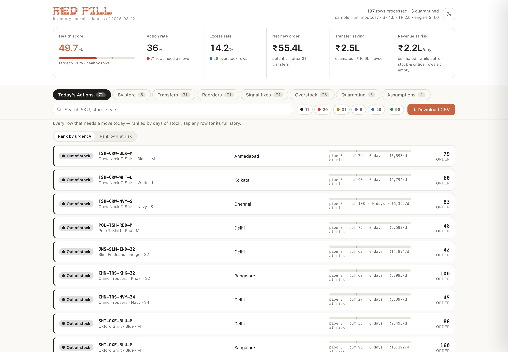
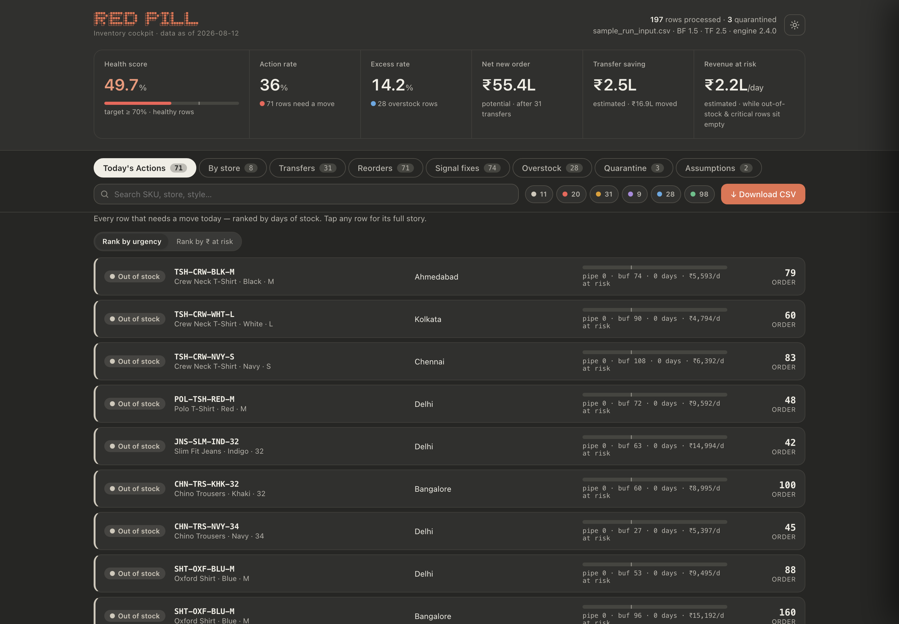
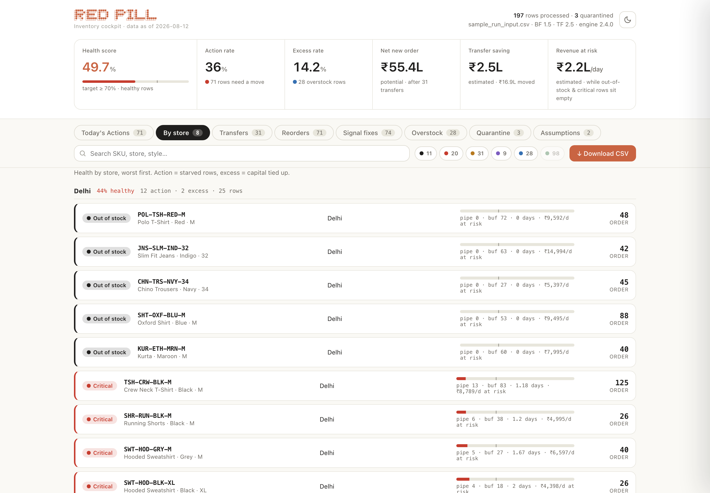
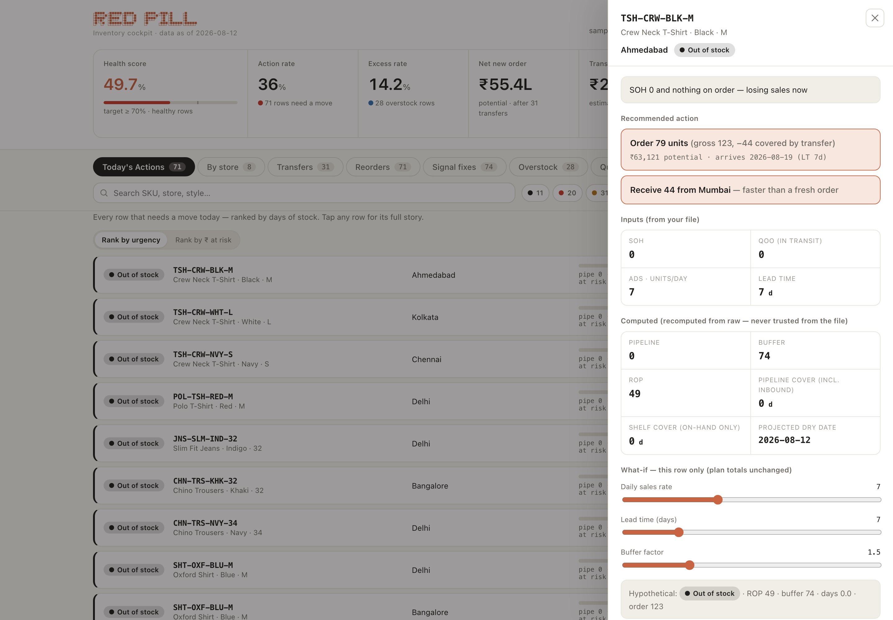
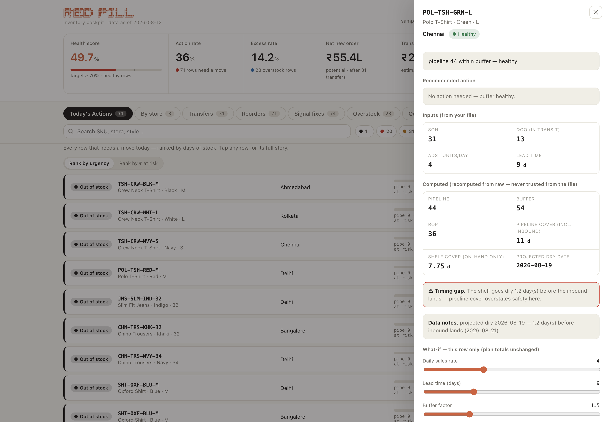
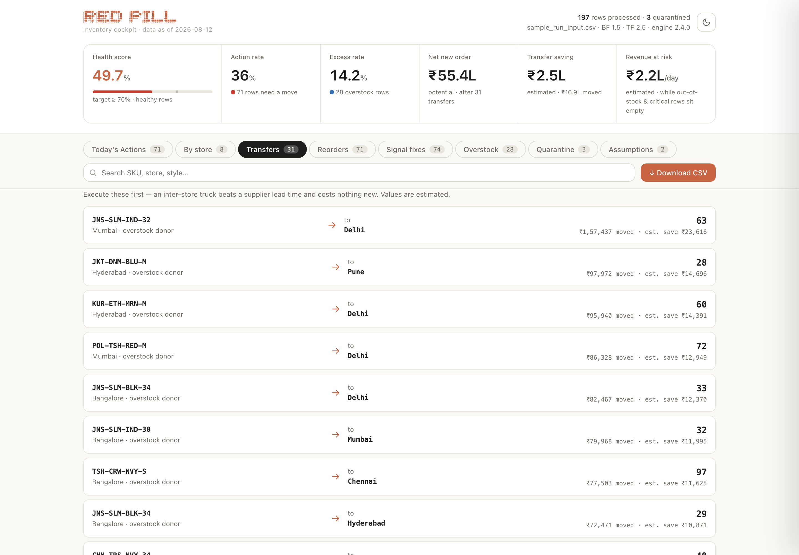
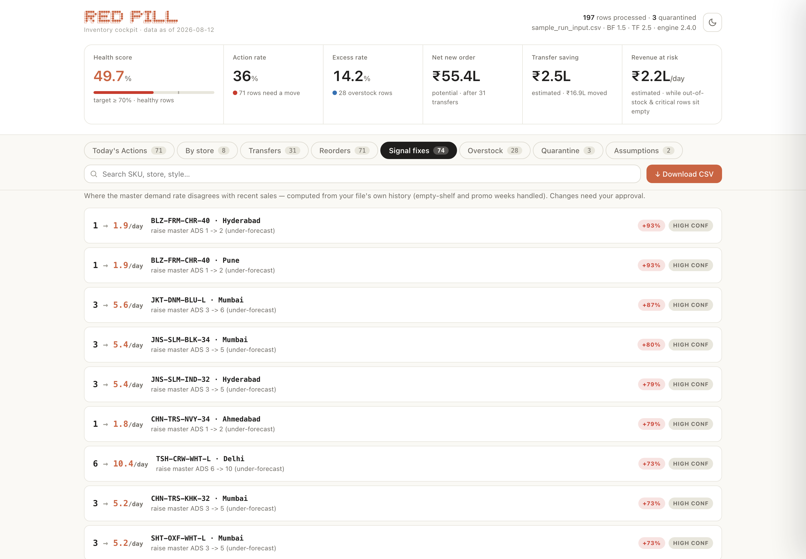
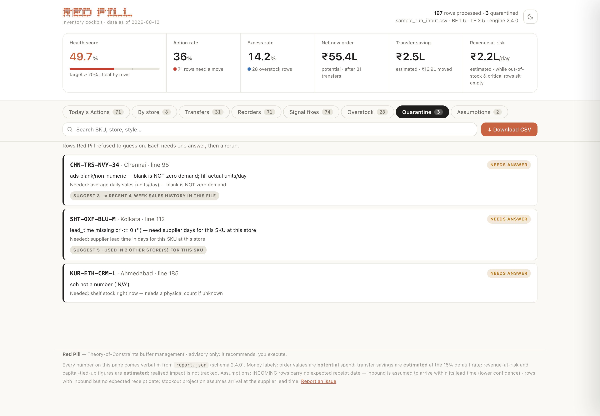
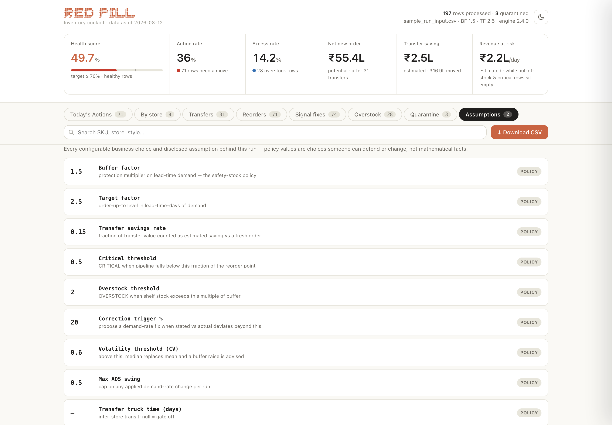

<p align="center">
  
</p>

# Red Pill

**A smart inventory decision system for retail — explained so anyone can understand it.**

---

## What is it?

Imagine Koushik manages **12 clothing stores**. Every Sunday they receive a giant Excel file
telling them: what products are in each store, how much is coming, how fast each product
sells, how long suppliers take to deliver, and what things cost.

The problem: a real Excel file is messy, incomplete, and sometimes wrong.

Red Pill takes that messy file and turns it into:

> **"Here is what needs your attention today, why, what you should do, and how much money
> is involved."**

Importantly, it **does not place orders or move stock**. It only recommends. You decide.

It runs inside [Claude](https://claude.com/product/claude-code) as a plugin — Claude handles
the conversation, and a deterministic calculation engine (plain Python, no internet access,
no telemetry) handles every number. Your file never leaves your machine except as part of
your own Claude conversation.

<p align="center">
  
</p>
<p align="center"><i>This is what you get after every run — real output from the bundled sample file.</i></p>

---

## How to install it in Claude

**Claude Code** (two commands, then it's available in every session):

```bash
/plugin marketplace add koushikeverything/redpill
```

```bash
/plugin install redpill@koushik-skills
```

> If that fails over SSH, use
> `/plugin marketplace add https://github.com/koushikeverything/redpill.git`.

**Claude desktop / web (no `/plugin` menu):** copy the `skills/redpill-inventory/` folder
into `~/.claude/skills/`, or upload `dist/redpill-inventory.skill`.

**No Claude at all?** The engine also runs standalone — see
[Running without AI](#running-without-ai) below.

---

## What benefits do I get?

- **Fewer stockouts** — you see which products run out first, ranked by urgency, before it
  happens.
- **Less money frozen in excess stock** — overstocked stores become *donors*: Red Pill
  proposes moving existing stock between stores **before** spending money on new orders.
  In the worked example below, that turns a ₹1,43,820 purchase into a ₹57,528 one.
- **Catches wrong master data** — if your system says a product sells 2/day but history
  shows 6/day, Red Pill notices, shows the evidence, and proposes the fix (it never applies
  it without your approval).
- **No silent guessing** — bad rows are set aside and asked about with suggested answers,
  never quietly "fixed". A file that's mostly broken gets told so, loudly.
- **Every number is traceable** — from the dashboard back to the exact Excel cell it came
  from. Six months later you can replay any run and get the byte-identical result.
- **One consistent dashboard** — the same layout every single run, light and dark mode,
  with downloadable transfer/order lists for whoever executes.

---

## Prerequisites

1. **Claude** — Claude Code (CLI/desktop/web) with plugin support, or any Claude surface
   where you can add the skill. For the standalone engine: just **Python 3.8+** (standard
   library only — nothing to install).
2. **Your stock file** (Excel or CSV) with one row per product-per-store, containing at
   minimum these five things:

   | Column | Plain meaning |
   |---|---|
   | SKU / product | which exact item (e.g. *Black T-shirt, size M*) |
   | Store | which location |
   | Stock on hand | units on the shelf right now |
   | Average daily sales | units/day this item sells at this store |
   | Lead time | days a fresh order takes to arrive |

   Nice-to-have extras: on-order quantity, unit price, weekly sales history,
   reserved/damaged stock, case-pack size. Column names don't need to match — Red Pill
   understands real-world headers like "Closing Stock", "Outlet", "Avg Off-take/Day", "MRP".

   No file yet? Run `/redpill:template` for a blank form, or try the bundled
   [sample workbook](examples/RedPill_Sample_MIS_Apparel.xlsx) as-is.

---

## How to use it

1. *(Optional, once)* **`/redpill:setup`** — five skippable questions: retail type,
   currency, which extra fields your file tracks, business rules ("never drain the flagship
   store"), budget. Stored locally in your project.
2. **Attach your stock file and run `/redpill:run`** (or just say *"run red pill on this"*).
3. **Answer what it asks** — one-tap questions with pre-filled suggestions, e.g. *"Oxford
   Shirt takes 7 days in your 10 other stores. Use 7 for Kolkata?"* Roughly ten questions
   max, then everything recalculates.
4. **Open the cockpit** — one dashboard page: what to do today, ranked. Click any row to
   see the full story behind it. Approve or reject any proposed master-data fixes.
5. **Download the transfer list and order list** (the ↓ Download CSV menu) and hand them
   to your team. Next week, repeat — your confirmed answers carry over.

Other commands: `/redpill:template` (blank input form) · `/redpill:policies` (business
rules) · `/redpill:explain` (walk any recommendation's arithmetic backwards).

---

# Red Pill, explained from zero

The rest of this README explains what's actually happening inside — written so a
non-technical reader can follow it, with real numbers throughout.

### The entire system in one picture

```
Messy Excel file
  ↓  understand what each column means
  ↓  clean and interpret the numbers
  ↓  reject information that cannot be trusted
  ↓  ask the human about uncertain information
  ↓  calculate inventory health
  ↓  check whether the sales forecast is believable
  ↓  apply business rules
  ↓  move existing stock between stores first
  ↓  calculate what still needs to be purchased
  ↓  prioritize what needs attention
  ↓  show everything in a simple dashboard
  ↓  save enough evidence that every number can later be traced
```

That is the whole product. Now let's go through it.

### The example we'll follow

Koushik is the planning head of a 12-store Indian apparel chain. Their Sunday file has
**30 products × 12 stores ≈ 360 rows** (plus one accidental duplicate). A **SKU** simply
means one exact product variant — *Black crew-neck T-shirt, size M* is a different SKU
from the same shirt in size L.

The file is deliberately realistic. It contains values like `1,240` and `₹2,499` and
`" 8 "` and `"7 days"` and `N/A` and `-6`, blanks, and that duplicate row. **Ten rows are
genuinely broken.**

So Red Pill's first job is not to calculate. Its first job is:

> **"Can I trust what I'm reading?"**

---

## Part 1 — Reading the file

**A very important design decision first:** the calculations are done by a deterministic
engine — plain Python code where *input → formula → result*, every single time. The AI is
the interface: it asks questions, explains results, presents recommendations. It is never
allowed to calculate an inventory number itself. And the original Excel file is copied and
**never modified**.

**Understanding column names.** Different companies call the same thing different names —
`Closing Stock`, `SOH`, `Stock Available`. Red Pill normalizes each header and looks it up
in an alias dictionary, with confidence levels: **exact** match, **high**-confidence alias
(like `run_rate` for daily sales), or **user-confirmed** (you told it once before — that
wins over everything). If two columns *both* seem to mean "stock", it doesn't pick one — it
marks the mapping **ambiguous** and asks you. If a mandatory column is missing entirely,
the run is **blocked**: no misleading numbers are shown, and you get a fill-in template
instead.

> **When the system doesn't know, it doesn't pretend to know.**

**Cleaning the values.** `₹2,499` → 2499. `1,240` → 1240. `" 8 "` → 8. `(500)` → −500.
But `N/A`, `abc`, and `"7 days"` are *unparseable* — and Red Pill does **not** say "I don't
understand N/A so I'll make it 0." That would be dangerous. Everything it cleans is
recorded: `price: parsed '₹2,499' → 2499`. That record is called **provenance** — "I can
show you exactly where this number came from."

**Freshness.** The run is stamped with the date the data was true ("data as of Sun 10
Aug"). A Sunday report is never dressed up as live inventory.

---

## Part 2 — The trust layer

Think of **quarantine** like airport security: if a passenger's documents have a problem,
you don't let them board and *guess* the missing information. You set them aside.

A row is quarantined when it can't be safely used:

| Problem | Example | Why it can't pass |
|---|---|---|
| Missing SKU or store | store = blank | don't know where this inventory belongs |
| Negative stock | `-6` | you can't have minus six T-shirts |
| Negative incoming | `-10` | not physically meaningful |
| Missing daily sales | blank | **blank ≠ zero.** Blank = "nobody told me". Zero = "we have evidence demand is zero". Completely different things |
| Bad lead time | blank, `0`, `"7 days"` | the whole model runs on it |
| Duplicate row | same SKU + store twice | first copy wins, later copies set aside — same input always gives the same answer |

A few special cases: blank *on-order* is safely assumed to be 0 (and disclosed); a genuine
ADS of 0 stays (zero demand is meaningful — it makes any stock excess); fractional stock
like `12.5` stays with a warning.

Koushik's result: **361 − 10 broken = 351 usable rows.**

**Red Pill doesn't just say "bad row."** For every quarantined row it computes a suggested
answer, called a **candidate**. Missing lead time, but the same SKU takes 8 days in four
other stores? → *"Use 8?"* The text `"7 days"`? → extract *7*. Missing daily sales, but the
row has four weeks of history (20, 22, 24, 23 = 89 ÷ 28 days)? → *"≈ 3.2/day?"* So instead
of asking you an open question, it asks a one-tap one. Your answers go into an overrides
file — the original spreadsheet is never touched — and the entire analysis reruns.

**Then the whole run gets a verdict:** ambiguous mapping or >20% quarantined → **DEGRADED**
(warning banner). >60% quarantined → **BLOCKED** (no plan shown at all). Otherwise
**HEALTHY**. Koushik: 10 ÷ 361 ≈ 2.8% → 🟢 healthy.

---

## Part 3 — The core inventory math

Five numbers per row. Follow one product: **Chennai, T-shirt** — stock 0, nothing coming,
sells 8/day, supplier takes 9 days.

**1. Pipeline = stock + on-order.** Everything you have or already have coming.
Chennai: 0 + 0 = **0**.

**2. Reorder Point (ROP) = daily sales × lead time.** What you'll sell *while waiting* for
a delivery — your **danger line**. Chennai: 8 × 9 = **72**. Fall below 72 and you're in
trouble, because that's exactly what customers will buy before help can arrive.

**3. Buffer = ROP × 1.5.** Real life isn't perfect — trucks run late, demand spikes. So add
a 50% cushion. Chennai: 72 × 1.5 = **108**. "72 is the danger line; 108 gives us breathing
room." (The 1.5 is configurable.)

**4. Days of stock = pipeline ÷ daily sales.** "How many days until I run out?" A store
with pipeline 300 selling 12/day has **25 days**. If daily sales are 0, Red Pill shows
**—**, not a fake zero.

But there's a catch: pipeline counts stock that **hasn't arrived yet**. 100 units landing
in 10 days can't sell tomorrow. So Red Pill shows two covers, not one — **pipeline cover**
(includes what's coming) and **shelf cover** (only what's physically on the shelf) — plus a
**projected dry date**: the day the shelf actually reaches zero, using the shipment's
arrival date when your file has one. If the shelf goes dark *before* the shipment lands,
the row is flagged with the gap in days. A store can look perfectly healthy on paper and
still have empty shelves for a day and a half in between — this is how you see it coming.

**5. Reorder quantity = (daily sales × lead time × 2.5) − pipeline**, rounded up, never
below zero — and **only for rows that actually need action**. The 2.5 means "when you do
order, refill to about 2.5 lead-times of demand" so you're not immediately reordering.
Chennai: 8 × 9 × 2.5 = 180, minus pipeline 0 = **order 180**. A healthy row gets zero:

> Don't order because you can. Order because you crossed the danger line.

**The status ladder.** Every row then gets exactly one status. Rules are checked top to
bottom — **the first match wins**, and the order matters:

| # | Condition | Status | Meaning |
|---|---|---|---|
| 1 | stock 0 and nothing coming | ⚫ **OUT OF STOCK** | losing sales right now |
| 2 | stock 0 but shipment coming | 🟣 **INCOMING** | watch it, don't double-order |
| 3 | pipeline < ½ × ROP | 🔴 **CRITICAL** | even ordering now may not save you |
| 4 | pipeline < ROP | 🟡 **REORDER** | order today |
| 5 | stock > 2 × buffer | 🔵 **OVERSTOCK** | too much cash sitting on shelves |
| 6 | everything else | 🟢 **HEALTHY** | leave it alone |

Chennai stops at rule 1: ⚫ OUT OF STOCK. Meanwhile **Mumbai** (same shirt: stock 300,
sells 12/day, 4-day supplier) → ROP 48, buffer 72, overstock line 144. Since 300 > 144:
🔵 OVERSTOCK, with **300 − 72 = 228 units above its comfortable buffer**. Remember that 228.

Why is the order a decision tree, not just a list? A store with stock 0 but 100 coming
must read INCOMING — not plain "reorder" — or you'd order twice.

**Headline health.** Koushik's file: **action rate 42.7%** (rows needing a move), **excess
rate 12.3%** (overstock), **45.0% healthy** against a target of ≥70%. Two separate numbers
on purpose — starving and overstuffed are opposite problems.

---

## Part 4 — Is the sales number even true?

Everything above trusted the file's "average daily sales". But what if someone typed
**2/day** five months ago and the product now sells **6/day**? Then ROP is wrong, buffer is
wrong, every order is wrong. So Red Pill's second job: **check whether the demand number is
believable**, using the file's own weekly sales history — while correcting three distortions:

**Empty-shelf weeks (censoring).** Weeks showing 0 sales while the product was out of
stock don't mean zero demand — customers *couldn't* buy. Those weeks are excluded, and
confidence drops because there's less evidence.

**Promotions.** Normal weeks sell ~42, then suddenly one week sells **126**. Averaging
that in would triple your "normal" demand. A week selling more than **2.5× the median** of
the others is flagged as a *suspected promotion* — but never removed automatically. Red
Pill asks: *"Was that week a promo?"* Only your confirmation excludes it.

**Volatility.** Sales of 10, 11, 9, 12 are stable; 2, 50, 3, 45 are jumpy. Red Pill
measures this (CV = how big the swings are vs the typical week; ≥0.6 = jumpy). For jumpy
products it uses the **median** week instead of the average, and recommends a *bigger
buffer* rather than chasing a number that doesn't sit still.

Then: **actual daily rate = last four usable weeks ÷ 28**, compared with the stated rate.
If they differ by more than ±20%, a correction is *proposed* — with a confidence grade
(six clean stable weeks ≫ three messy ones).

**The Chandigarh case.** File says 2/day. History says 34, 40, 42, 44 → 160 ÷ 28 =
**5.7/day**. That's **+186%**, high confidence: *"raise master ADS 2 → 6."* And it matters:
the same 12 units on the shelf are "6 days of stock, order 23" under the old number — but
"**2 days** of stock, order **93**" under the honest one. A wrong master number was hiding
a real crisis.

**Verify-first protection.** Suppose history claims ~5.8/day but the shelf holds **500**
units — more than 1.5× everything supposedly sold in 8 weeks (5.8 × 7 × 8 ≈ 325). Those two
facts contradict each other; maybe the stock count is wrong. Red Pill refuses to build an
expensive recommendation on it and says: **"verify count first."**

**Governance.** Corrections are proposals. Nothing rewrites your master data; you approve,
then the run is redone (with a ±50% cap per run, low-confidence corrections skipped, every
application logged). The AI never silently changes the company's source of truth.

---

## Part 5 — Real-world rules before any recommendation

- **Sellable stock:** "we have 60" doesn't mean "we can move 60" — maybe 10 are reserved
  for online orders and 2 are damaged. Sellable = 60 − 10 − 2 = **48**.
- **Policies override math:** a *protected* store never donates; a *blocked lane* never
  carries a transfer; a *clearance* product is never reordered. Recommendation =
  math **+** business constraints.
- **Incoming isn't automatically safe:** if what's coming is still below the danger line →
  *"top-up order needed"*; below half → *"order more now"*; arriving later than a fresh
  order would → *"the shipment is too late"*; a promised date that has already passed →
  *"inbound overdue"*; no arrival date → the assumption is disclosed.
- **Overcommit:** shelf looks fine (40 units) but **400** are inbound — pipeline 440 versus
  a small buffer. The ladder alone can't see it; a flag says *"trim the open order"* while
  you still can.

---

## Part 6 — The clever part: transfer before you buy

Mumbai has **228 spare** shirts. Chennai needs some. Why spend new money?

```
Donor surplus   = sellable stock − buffer      →  Mumbai: 300 − 72  = 228
Receiver need   = buffer − pipeline            →  Chennai: 108 − 0  = 108
Transfer        = the smaller of the two       →  min(228, 108)     = 108
```

**Move 108 Mumbai → Chennai.** Mumbai still keeps 120 above its buffer — a donor never
dips below its own safety cushion. And a 2-day truck beats a 9-day supplier while spending
nothing new.

Each proposed transfer must pass reality checks: if the *supplier* is actually faster than
the truck, order fresh instead; quantities round **down** to whole shipping cartons (need
27, cartons of 12 → send 24 — never oversupply); protected stores and blocked lanes are
respected; repeated moves on the same route are grouped so one weekly truck replaces four
couriers. And timing is checked too: if the receiving store will run dry *before* the
truck arrives, the move is still recommended — but flagged **"expedite"**, because a
mathematically perfect transfer that lands a day late still loses a day of sales.

**Money:** moving 108 × ₹799 = ₹86,292 of inventory, with an *estimated* saving of 15% ≈
**₹12,944** (the 15% is a stated, tunable assumption — and "value moved" is never called
"value saved"). If you tell Red Pill a transfer costs ₹10/unit, it shows cost ₹1,080 and
net benefit ≈ ₹11,864. If the cost is unknown, it stays **unknown — not zero**, because
unknown ≠ free.

**Then buy only what's left.** Chennai needed 180; 108 arrive by transfer; **order 72** —
₹57,528 instead of ₹1,43,820. Across Koushik's whole file: gross purchase need **₹1.63
crore** shrinks to **net ₹1.16 crore**, and the ~₹47 lakh difference reconciles exactly
with the ₹46.9 lakh of inventory the 83 transfers moved. The math is internally consistent.

Optional extras: give it a **budget** (₹50L available?) and it splits orders into
*within budget* and *deferred* — visibly, never silently deleting anything. Every red flag
carries a **next move** (expedite, substitute, hold remaining stock for full price, or
verify the count) — no dead-end alarms.

---

## Part 7 — Priorities and insight

- **The urgency queue:** actionable rows sorted by days-of-stock — whoever runs out first
  appears first. Ties break by file order, so the ranking is deterministic.
- **Money-ranked urgency:** one day out of stock on a ₹100 accessory and on a ₹8,000
  jacket are not the same emergency. Every out-of-stock and critical row shows its
  **revenue at risk per day** (daily sales × price, labelled *estimated*), and one toggle
  re-ranks the whole queue by ₹ instead of days. Overstock rows get the mirror-image
  number: **capital tied up** above the buffer.
- **ABC-XYZ:** ABC ranks products by money-importance (daily sales × price, cumulative:
  top 70% = A, to 90% = B, rest = C); XYZ grades demand stability from volatility. An
  **A-X** (important + stable) deserves different treatment from a **C-Z** (marginal +
  unpredictable).
- **Weighted health:** 100 cheap healthy products can hide 10 expensive unhealthy ones. So
  besides "45.0% of rows healthy", Red Pill reports what share of daily *revenue* sits in
  healthy inventory (Koushik: 46.1%).
- **Broken size runs:** a rack with S, L, XL but **no M** looks stocked — but M-customers
  walk, and the leftover sizes strand. Red Pill checks each store × style × colour family
  and flags these (Koushik's file: 10 breaks).

---

## Part 8 — What you actually see, and why you can trust it

**The cockpit** is one fixed dashboard, identical layout every run — the display layer
contains zero calculations (the engine thinks, the renderer displays). Here it is, screen
by screen, using real output from the sample file.

Quick orientation before the screenshots: the page is always **three layers**. On top, six
**KPI cards** — the ten-second read. Under that, the **control bar**: eight **tabs** (same
data, eight different questions), a search box, six **status counters** you can tap on and
off to filter, and one **↓ Download CSV** button. Below, the **list** — whatever the
selected tab is showing. In every screenshot that follows, look at which tab is
highlighted dark — that's the view you're seeing.

### The top strip — your ten-second read



*(Shown in dark mode — the toggle is the moon/sun button top-right. Every other
screenshot below is the same page in light mode.)*

Left to right across the six cards:

- **Health score (49.7%)** — what share of rows are 🟢 healthy. The little bar shows the
  ≥70% target; below it means the operation needs work.
- **Action rate (36%)** — what share of rows need a *move* (out of stock, critical,
  reorder, incoming). "71 rows need a move" is your workload.
- **Excess rate (14.2%)** — what share are overstocked. Starving and overstuffed are
  opposite problems, so they're never blended into one number.
- **Net new order (₹55.4L)** — what you'd spend on fresh orders *after* transfers cover
  what they can. Labelled **potential** because nothing has been ordered yet.
- **Transfer saving (₹2.5L)** — the **estimated** benefit of moving ₹16.9L of existing
  stock instead of buying new. Never called "saved" — nothing is saved until you execute.
- **Revenue at risk (₹2.2L/day)** — what the empty shelves cost you *per day*: daily
  sales × price, summed over every out-of-stock and critical row. **Estimated**, and the
  single best number for getting management's attention.

Top-right corner: the light/dark toggle and the run stamp — file name, rows processed vs
set aside, engine version, and the date the data was true.

### The control bar — tabs, filters, and one download button

The **eight tabs** ask eight different questions of the same rows: *Today's Actions*
(what do I do now?) · *By store* (which location is in trouble?) · *Transfers* (what can
I move instead of buy?) · *Reorders* (what must I purchase?) · *Signal fixes* (where is
my master data lying?) · *Overstock* (where is cash frozen?) · *Quarantine* (what
couldn't be trusted?) · *Assumptions* (what rules produced all this?). Each tab shows its
count in a small chip, so you know the workload before you click.

The **six colored counters** next to the search box are the status filters — one per
status (⚫ out of stock · 🔴 critical · 🟡 reorder · 🟣 incoming · 🔵 overstock ·
🟢 healthy), each showing its row count. **Tap any of them to switch that status off or
on** — the lists below update instantly. Hunting only stockouts? Switch everything else
off. They work across Today's Actions, By store, Reorders, and Overstock.

And instead of hunting for the right export, there's one **↓ Download CSV** button — it
opens a small menu: **Plan CSV** (every row with statuses, covers, and order quantities)
or **Transfers CSV** (the move list) — the two files you hand to your team.

### Today's Actions — the default view

Each row reads left to right: the **status pill** (⚫ out of stock…) · the **product**
(SKU code + plain name, colour, size) · the **store** · a small **fuel-gauge bar** (how
full the pipeline is vs the buffer, with a tick at the danger line — `pipe 0 · buf 74 ·
0 days · ₹9,592/d at risk` means an empty tank that's costing money) · and the **number
that matters**: how many units to order.

Just above the list sit two small chips: **Rank by urgency** (default — whoever runs out
first, first) and **Rank by ₹ at risk** — same rows re-ranked so the expensive
emergencies rise to the top. That's the answer to "one day of a ₹100 SKU shouldn't
outrank one day of a ₹10,000 SKU."

### By store — which location needs help



The same rows grouped **by store, worst first**. Each store's header gives its own health
score, action count, and excess count — so "Delhi is 44% healthy with 12 rows needing a
move" jumps out before any scrolling. In this screenshot the 🟢 **Healthy counter is
switched off** (top right, greyed out) — that's the filter row doing its job: only the
problems remain visible.

### Click any row — the full story behind one number



Top to bottom: the **reason in one sentence** ("SOH 0 and nothing on order — losing sales
now") · the **recommended action** — here *Order 79* (the gross need was 123, minus 44
already covered by a transfer), with the ₹ value and arrival date, plus *Receive 44 from
Mumbai — faster than a fresh order* · the **inputs from your file** (stock, on-order,
daily sales, lead time) · the **computed values** — pipeline, buffer, danger line, and
now **both covers**: *pipeline cover* (counting inbound) vs *shelf cover* (on-hand only),
plus the **projected dry date** ("recomputed from raw, never trusted from the file") ·
and the **what-if sliders**: drag the sales rate or lead time and watch this one row's
status recompute. Marked *"this row only — plan totals unchanged"* — a thought
experiment, not an edit.

### The timing gap — healthy on paper, dark shelves tomorrow



This row is rated 🟢 healthy — pipeline quantity says everything is fine. But open the
drawer: shelf cover is shorter than the wait for the shipment, so the red note says the
shelf goes dry **before the inbound lands**. Quantity-counting alone can never catch
this; the projected dry date does. In the sample file, 12 rows hide this exact trap.

### The Transfers tab — move stock before buying stock



Every card is one move: **which product, from which overstocked store, to which starving
store, how many units** — with the inventory value moved and the estimated saving side by
side (moved ≠ saved, always). These execute first because a truck between your own stores
beats a supplier lead time and costs nothing new. If a receiving store would run dry
before the truck could arrive, the card carries an amber **"expedite"** warning.

### The Signal-fixes tab — where your master data is lying



Each card compares the sales rate **your file claims** with what **recent history shows**:
`1 → 1.9/day` means the file says this blazer sells 1 a day, reality says almost 2 —
**+93%**, high confidence. Empty-shelf weeks and promo weeks have already been handled.
These are *proposals* — nothing changes your master data until you approve it.

### The Quarantine tab — what it refused to guess



Every set-aside row, each with its **reason in plain words** and a **suggested answer**
("suggest 7 · used in 4 other stores for this SKU"). Answer these — one tap each — and
the whole analysis reruns with your corrections logged.

### The Assumptions tab — the rules behind every number



The honesty page. Every **policy value** used in this run — buffer factor 1.5, target
factor 2.5, the danger and overstock lines, the 15% savings rate — shown as a card with
its plain-English meaning and a *policy* tag, because these are **business choices someone
can defend or change, not mathematical facts**. Below them: everything the run had to
*assume* (e.g. "blank on-order treated as 0", "no arrival dates — inbound assumed to land
within lead time"). If an auditor, a CFO, or a skeptical supply-chain professional asks
*"why these numbers?"* — this tab is the answer.

In chat, alongside all this, the AI gives you about **five lines** — verdict, the two
rates, order value, savings, top three actions — plus only the questions that genuinely
need a human. Long reports only if you ask.

**The paper trail.** Every run saves: the untouched original file, the authoritative
results file, the calculated table, the quarantine list (which doubles as a fill-in form),
and snapshots of every setting used — all fingerprinted with SHA-256 hashes (change one
byte anywhere and the fingerprint changes). Six months later, `--rerun` replays the run
from its own stored inputs and verifies the output is **byte-identical**. Same inputs, same
version, same rules → exactly the same answer.

**The tests.** A 62-test suite runs before every release. It pins Koushik's exact
reference numbers (351/10, 42.7%, ₹1.16 cr, 83 transfers…) *and* the business laws that
must never break: a donor never dips below its buffer, a healthy row never gets an order,
totals always reconcile, nothing is ever recommended from a quarantined row, a stated
sales rate of zero never causes a division error, and the timing math never lets pipeline
quantity hide an empty shelf.

**The boundary.** Red Pill is advisory only. It does not write to your ERP, create or send
purchase orders, move stock, send messages, or touch any cloud service. Savings realised =
₹0 until your business actually executes something.

### Every dial, in plain English

| Setting | Default | Simple meaning |
|---|---:|---|
| Buffer factor | 1.5 | how much safety cushion to keep |
| Target factor | 2.5 | how full to refill when ordering |
| Critical line | ½ × ROP | below this, you're in serious danger |
| Overstock line | 2 × buffer | above this, too much cash is tied up |
| ADS deviation tolerance | ±20% | how wrong the sales rate must be before proposing a fix |
| Volatility threshold | CV 0.6 | when demand counts as "jumpy" |
| Promo trigger | >2.5× median week | when a spike looks promotional |
| Verify-first | >100% deviation + stock >1.5× 8-wk sales | when sales and inventory contradict |
| ADS correction cap | ±50% | maximum correction applied per run |
| Transfer savings | 15% | estimated saving from moving vs buying |
| Transfer cost / lane time / budget | optional | economics, truck-vs-supplier gate, budget split |
| Run verdict | >20% / >60% quarantined | when a file is degraded / blocked |

### If you forget everything else

Red Pill asks six questions, in order:

1. **Can I read the file?** If not → ask, or block.
2. **Can I trust the data?** If not → quarantine and ask, with suggested answers.
3. **How much stock do I really have?** *(stock + incoming)*
4. **How much do I need to survive the waiting time?** *(daily sales × lead time)*
5. **Is my demand number actually believable?** *(check it against real history)*
6. **What's the cheapest fix?** **Move existing stock first — then buy what's still missing.**

…and then shows you exactly what to do, why, how much money is involved, and where every
number came from.

---

## Running without AI

The engine is plain Python (3.8+, standard library only) and runs by itself:

```bash
python3 skills/redpill-inventory/scripts/redpill_engine.py your_file.csv \
  --run-dir runs/2026-08-12 --as-of 2026-08-12
python3 skills/redpill-inventory/scripts/render_cockpit.py --run-dir runs/2026-08-12
```

Open `runs/2026-08-12/cockpit.html` in a browser. `--rerun runs/2026-08-12` verifies
reproducibility; `--template` produces a blank input form.

## Known limitations (honest list)

- Transfer lane times/costs are opt-in — unset, transfers assume in-network moves beat
  supplier lead times.
- Demand corrections are proposals; stockout-censoring uses a "currently out of stock"
  heuristic (weekly files don't record per-week availability); suspected promos need your
  confirmation.
- The 15% savings rate is a stated assumption, always labelled *estimated*.
- Stores only (no warehouse/DC node yet). Apparel-first; no grocery/pharmacy physics
  (expiry, substitution).

## For developers

```bash
make test    # 62-test suite: goldens, invariants, reproducibility
make build   # package the skill -> dist/redpill-inventory.skill
```

`SPEC.md` is the canonical design + gap register, `Observations.md` the living defect log,
`roadmap.md` the triage of every proposal. CI runs the suite and rebuilds the bundle on
every push. See `CONTRIBUTING.md` and `CHANGELOG.md`.

**Troubleshooting:** *"Missing required columns"* → the engine wrote what it did find into
`report.json` plus a fill-in template; rename headers or pass `--mappings`. *Everything
quarantined?* → open `quarantine.csv`; every row has a reason and a suggested answer.
*Numbers differ from your ERP's status column?* → by design: Red Pill recomputes from raw
inputs and flags disagreements — that's usually how you find out the ERP is stale.

## License

MIT © 2026 — see [LICENSE](LICENSE).
